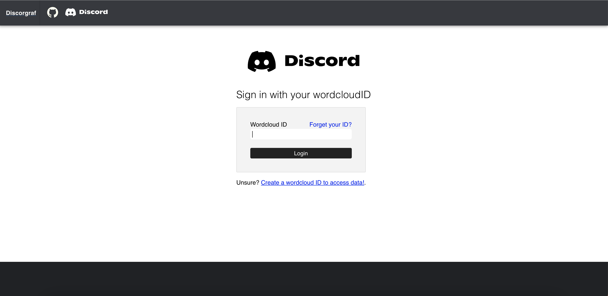
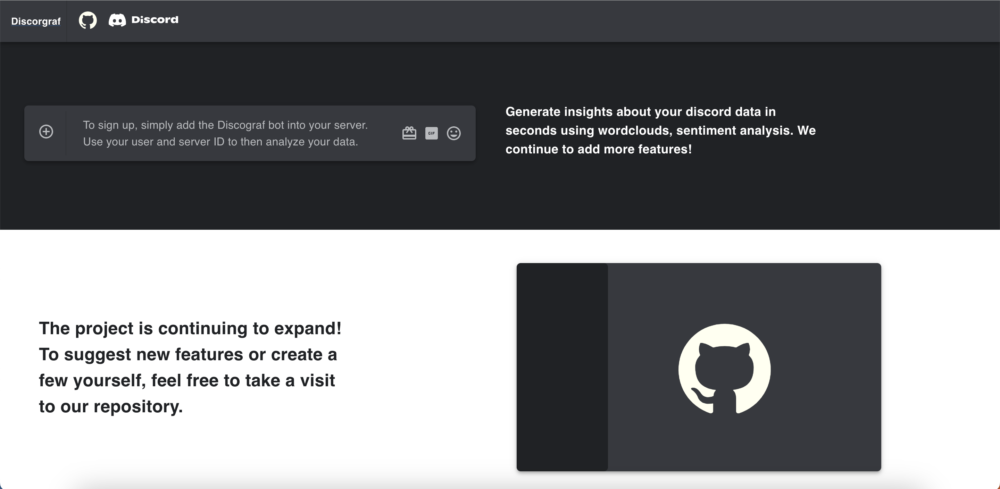

# :computer: Discograf Documentation
Discograf is an application focused on enbaling users to visualize and analyze their message content on Disord. The aim is to use discord message data to create wordclouds, perfrom sentiment analysis and create a user-recap not unlike Reddit Recap.

The project is an ongoing effort with various components that you can contribute to. There are four principal components

1. UI Frontend. This component is the presentation layer and is made using React JS and the material UI compoent library. 
2. Data backend. This component (this repository) is focused on delivering user data to both the discord Bot and the discord web UI. It communicates both with the PostgresSQL server, the Flask resource server and all frontend components. This component is fully complete currently. 
3. The crux of the wordcloud/sentiment analysis functionality is implemented in a seperate resource server that communicates with the Node JS backend (This decision was made to avoid doing compute intensive tasks in the backend) The wordcloud is made using a pruned prefix-tree, employing a strategy similar to autocomplete algorithms. 
4. The Discord bot itself. The bot itself is a standard discord bot with support for functionality such as /id and /wordcloud. The bot is implemented using Discord JS.
   
## :inbox_tray: Dependancies And Installation 
The project used standard ```Node JS ``` structure and all dependancies can be found in the file ```package.json``` at the root of the project. 
1. Add the <kbd>Discograf</kbd> directory into your projects directory using the <kbd>git clone</kbd> commpand.
2. Install the dependancies using 
-  <kbd>npm install package.json</kbd> 
-  Do not that a config.json file will be needed to perfrom tests. 
3. Ensure all is well using the command, ```npm start```. This will create a development server suitable for protyping and testing on your system.
   
You are now ready to contribute to the project!
## :pushpin: Quickstart
To communicate with the PostgresSQL server, the ```sequelize``` ORM must be used. Currently we have various functions responsible for CRUD operations. 

To identify each disord user and server, we create a wordcloud ID that uniquely ties the user to a generated wordcloud.

```javascript
async function RetrieveWordcloudIDFromDatabase(content) {
  const result = await BotWordcloudID.findOrCreate({
    where: {
      ServerID: content.serverID,
      MessageAuthorID: content.author
    },
    defaults: {
      WordcloudID: uuidv4()
    }
  })
```
A new wordcloud ID is generated each time a user updates it. However when retrieve ID function is not to be used when a user updates an ID instead, the following should be used. 

```javascript
async function UpdateWordcloudIDInDatabase(content) {
  await RetrieveWordcloudIDFromDatabase(content)

  const result = await BotWordcloudID.update(
    {
      WordcloudID: uuidv4()
    },
    {
      where: {
        ServerID: content.serverID,
        MessageAuthorID: content.author
      },
      returning: true
    }, 
  )
  ....
```

To understand more about different SQL tables that are used, please refer to <kbd>sequqlize/sequelModels.js</kbd> which contains the ORM mapping for the SQL database. 

For example, here is BotChannels. 
```javascript
BotChannels.init(
  {
    ServerID: {
      type: DataTypes.TEXT,
      allowNull: false,
    },
    MessageChannelID: {
      primaryKey: true,
      type: DataTypes.TEXT,
      allowNull: false,
    },
  },
  {
    timestamps: false,
    sequelize: sequelize,
    tableName: "BotChannels",
  }
);
```

Besides code for CRUD operations, we rrquest that it is accompanied by extensive tests. We have worked very hard on ensuring that we have a sufficient number of tests to protect us against runtime errors in Async requests which could crash the server. 

Our tests can be found in the <kbd>tests</kbd> directory and are organised based on module. For example, the file <kbd>auth.test.js</kbd> contains tests for the wordcloud functionality. 

```javascript
test("Test to determine if the serverID can be retrieved from databse using wordcloudIF", async () => {
    var RetrievedContent =  (await RetrieveWordcloudIDFromDatabase(content)).at(0)
    const result = await RetrieveServerIDFromDatabase(RetrievedContent.wordcloudID)
    expect(result.author).toStrictEqual(RetrievedContent.author)
    expect(result.createdAt).toStrictEqual(RetrievedContent.createdAt)
    expect(result.serverID).toStrictEqual(RetrievedContent.serverID)
  })
```

Our express server is a standard web server in the folder <kbd>routes</kbd>. We are using ```axios``` for HTTP requests and request that it be used in any contributing source code.

```javascript
async function GetWordcloud(authorID, serverID) {
  const result = await axios.get(
    API_URL.concat("/wordcloud/").concat(authorID+"/").concat(serverID) 
  ).catch(function (error) {
    console.log(error)
  })
  return result['data']
}

```


## :hammer_and_wrench: Contributing to the project
If you would like to contribute to the project, feel free to create a pull request. Make sure that all documentation is present for any changes.  
## :scroll: License
The library is licensed under <kbd>GNU GENERAL PUBLIC LICENSE</kbd>
